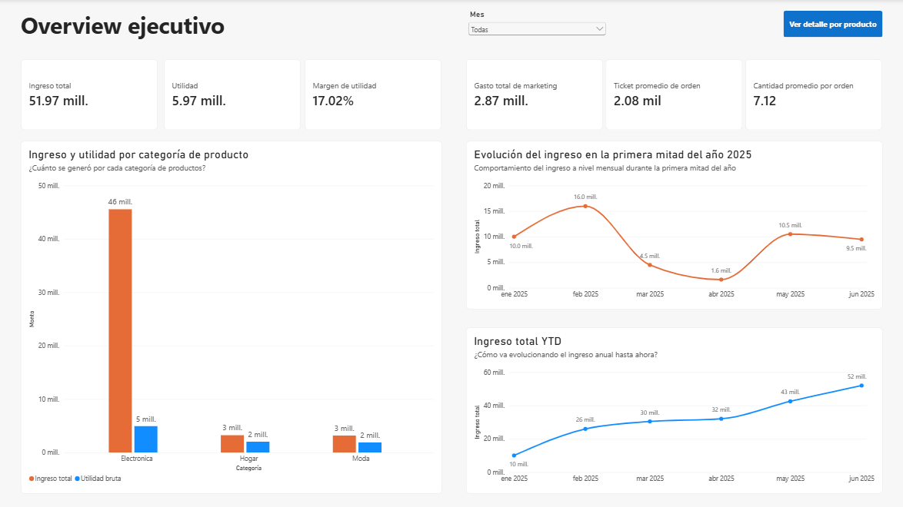
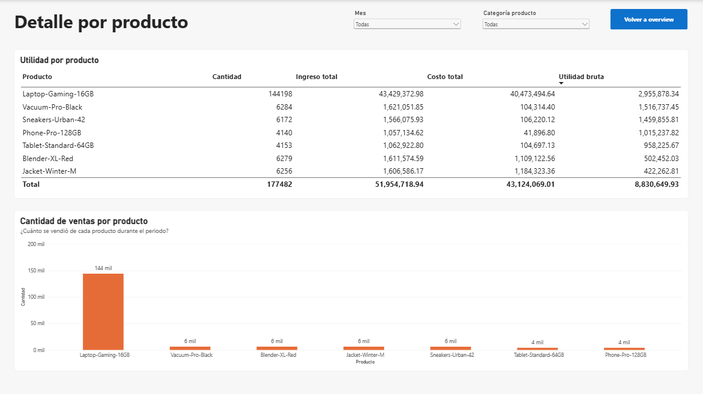
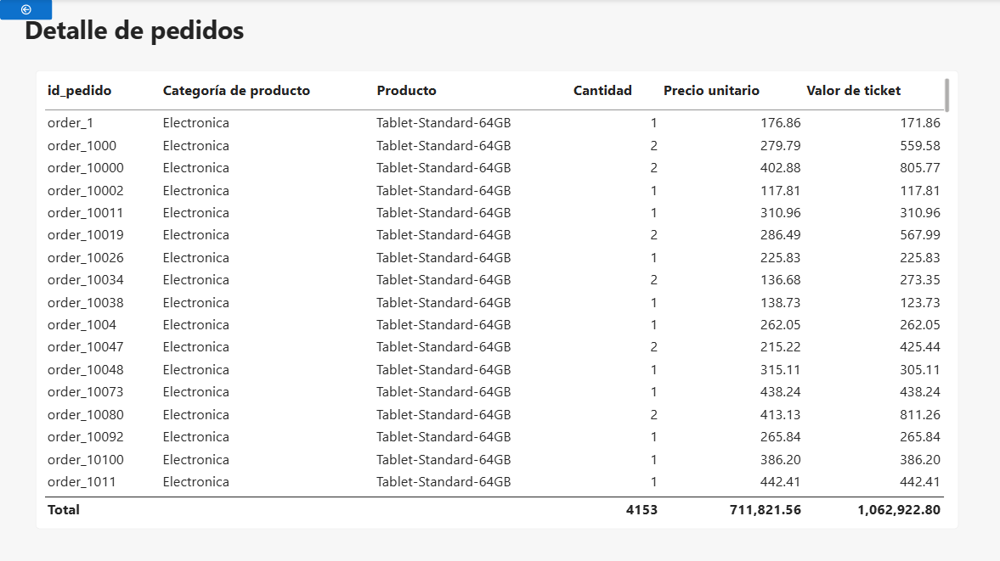

# 🛵 Análisis de desempeño económico de RappiPlus (H1 2025)


## 📌 Descripción del proyecto

Análisis del desempeño económico del servicio **RappiPlus** durante la primera mitad de 2025 (**01/01/2025 – 30/06/2025**), con foco en ingresos, costos, inversión en marketing y rentabilidad.

El proyecto transforma tres fuentes de datos (pedidos, catálogo de productos y gasto en marketing) en indicadores clave del negocio y los comunica mediante un dashboard, con el fin de responder preguntas clave y proponer **recomendaciones accionables**.

---

## 🎯 Objetivos

- Validar y depurar la calidad de los tres datasets antes de calcular cualquier métrica.
- Calcular los KPIs principales: ingreso, costo, inversión en marketing, utilidad y margen.
- Identificar el producto más vendido y la distribución del gasto en marketing por canal.
- Comunicar los resultados en un dashboard claro para audiencias de negocio.

---

## 🔄 Flujo metodológico

**Carga y validación de datos** → **Análisis de rentabilidad** → **Comunicación de resultados (Dashboard)**

| Fase | Descripción |
|------|-------------|
| 🧹 **1. Carga y validación de datos** | Carga de los tres CSV, conversión de fechas, revisión de valores numéricos inválidos, consistencia de montos, duplicados, valores atípicos y nulos en variables categóricas. Exportación de datasets limpios. |
| 💰 **2. Análisis de rentabilidad** | Unión de pedidos con costos del catálogo y cálculo de ingreso total, costo total, inversión en marketing, utilidad, margen, ticket promedio, cantidad promedio por orden, producto más vendido y gasto por canal. |
| 📊 **3. Comunicación de resultados** | Dashboard con tres vistas: overview ejecutivo, detalle por producto y drill-through a nivel de pedido. |

### Reglas de limpieza aplicadas

| Verificación | Tratamiento |
|--------------|-------------|
| Fechas (`fecha_hora_pedido`, `fecha`) | Conversión a `datetime`. |
| Cantidades inválidas (≤ 0) | Eliminación de los registros para no distorsionar las métricas. |
| Consistencia de `monto_total` | Validado contra `cantidad × precio_unitario − monto_descuento`; diferencias máximas de ±0.01 (redondeo), sin cambios. |
| Pedidos duplicados | Eliminación por `id_pedido`, conservando el primer registro. |
| Valores atípicos en `monto_total` (IQR) | Se conservan por representar ingresos reales. |
| Nulos en `nombre_producto` / `categoria_producto` | Se rellenan con `"Desconocido"` y `"Otros"` para conservar la transacción en el ingreso. |

> 📉 **Orders:** 25,100 registros originales → 24,946 tras la limpieza.

---

## 🗂️ Diccionario de datos

### `rappiplus_orders_raw.csv` (pedidos)

| Columna | Tipo | Descripción |
|---------|------|-------------|
| `id_pedido` | Categórica | ID único del pedido. |
| `id_usuario` | Categórica | Identificador del usuario que realizó el pedido. |
| `fecha_hora_pedido` | Fecha | Fecha en la que se realizó el pedido. |
| `pais` | Categórica | País desde donde se realizó el pedido. |
| `dispositivo` | Categórica | Dispositivo utilizado para realizar el pedido. |
| `fuente_referencia` | Categórica | Canal de adquisición del usuario. |
| `nombre_producto` | Categórica | Producto comprado. |
| `categoria_producto` | Categórica | Categoría del producto. |
| `cantidad` | Numérica | Cantidad de productos comprados. |
| `precio_unitario` | Numérica | Precio por unidad del producto. |
| `monto_descuento` | Numérica | Descuento aplicado al pedido. |
| `monto_total` | Numérica | Monto total pagado por el pedido. |

### `rappiplus_catalog.csv` (catálogo)

| Columna | Tipo | Descripción |
|---------|------|-------------|
| `nombre_producto` | Categórica | Nombre del producto. |
| `categoria_producto` | Categórica | Categoría a la que pertenece el producto. |
| `costo_unitario` | Numérica | Costo por unidad del producto. |
| `proveedor` | Categórica | Empresa proveedora del producto. |

### `rappiplus_marketing_spend.csv` (marketing)

| Columna | Tipo | Descripción |
|---------|------|-------------|
| `fecha` | Fecha | Fecha en la que se realizó la inversión. |
| `pais` | Categórica | País donde se ejecutó la campaña. |
| `id_campaña` | Categórica | Identificador único de la campaña. |
| `canal` | Categórica | Canal de marketing utilizado. |
| `gasto` | Numérica | Monto invertido en la campaña. |

> 📊 **Volumen:** 25,100 pedidos (raw), 7 productos en el catálogo y 1,620 registros de gasto en marketing.

---

## 🔑 Resultados clave

### Situación
RappiPlus generó **$51.97 M** en ingresos durante el primer semestre de 2025, con una inversión en marketing de **$2.87 M** repartida entre tres canales (orgánico, búsqueda pagada y redes sociales).

### Complicación
El costo de los productos vendidos absorbe el **83%** del ingreso y el marketing otro **5.5%**, por lo que el margen final es reducido. Además, las ventas dependen en gran medida de un solo producto, lo que concentra el riesgo operativo.

### Pregunta
¿Qué tan rentable fue el servicio en el periodo y qué factores explican ese nivel de utilidad?

### Respuesta

| KPI | Valor |
|-----|-------|
| 💵 Ingreso total | $51,966,981.56 |
| 📦 Costo total de productos | $43,124,069.01 |
| 📣 Inversión en marketing | $2,871,843.53 |
| ✅ Utilidad | $5,971,069.02 |
| 📈 Margen de utilidad | 11.49% |
| 🧾 Ticket promedio por orden | $2,083.18 |
| 🛒 Cantidad promedio por orden | 7.12 |

- **Estructura de costos:** el costo de productos equivale al 83% del ingreso y el marketing al 5.5%, lo que deja una utilidad de $5.97 M (11.49% de margen).
- **Producto estrella:** la **Laptop-Gaming-16GB** es el producto más vendido por amplia diferencia, con **144,198 unidades** (≈81% de las unidades del semestre) frente a entre 4,100 y 6,300 de los demás productos. Mantener su inventario es clave para sostener el ingreso.
- **Marketing:** el gasto por canal es equitativo (redes sociales $918 K, orgánico $914 K y búsqueda pagada $863 K), con redes sociales ligeramente por encima.

---

## 📊 Dashboard

El dashboard se construye a partir de los CSV limpios (`orders_clean.csv`, `catalog_clean.csv`, `marketing_clean.csv`) con las relaciones `orders.nombre_producto → catalog.nombre_producto` y una tabla de fechas para comparaciones temporales.

| Vista | Contenido |
|-------|-----------|
| **1. Overview ejecutivo** | Revenue total, profit total, gasto en marketing, ticket promedio y cantidad promedio por orden. |
| **2. Detalle por producto** | Tabla de utilidad por producto (cantidad, ingreso, costo y utilidad bruta) y gráfico de barras de cantidad vendida. |
| **3. Drill-through** | Tabla de pedidos filtrada por el producto seleccionado en la utilidad por producto. |

🔗 **[Ver dashboard](https://drive.google.com/file/d/1no4Op-XiwL-zbQtSixJPenZInxt9z8WL/view?usp=sharing)**





---

## 🛠️ Tecnologías utilizadas

| Categoría | Herramientas |
|-----------|--------------|
| Lenguaje | Python |
| Manipulación de datos | `pandas`, `numpy` |
| Visualización | `matplotlib` |
| BI y dashboard | Power BI |
| Entorno | Jupyter Notebook |

---

## 📁 Estructura del repositorio

```
📦 Analisis-de-desempeno-RappiPlus
├── 📂 DATA
│   ├── RAW
│   │   ├── rappiplus_orders_raw.csv
│   │   ├── rappiplus_catalog.csv
│   │   └── rappiplus_marketing_spend.csv
│   └── CLEAN
│       ├── orders_clean.csv
│       ├── catalog_clean.csv
│       └── marketing_clean.csv
├── 📂 NOTEBOOKS
│   └── Analisis_desempeno_RappiPlus.ipynb
├── 📂 IMAGES
│   ├── dashboard_overview.png
|   ├── detalle_overview.png
|   └── drill_through_overview.png
├── 📄 README.md
└── 📄 LICENSE.txt
```

---

## ▶️ Cómo reproducir el análisis

1. Clona el repositorio:
   ```bash
   git clone https://github.com/alexisjmz88/Analisis-de-desempeno-RappiPlus.git
   ```
2. Instala las dependencias:
   ```bash
   pip install pandas numpy matplotlib jupyter
   ```
3. Ejecuta `notebooks/Analisis_desempeno_RappiPlus.ipynb` (genera los CSV limpios).
4. Carga los CSV limpios en Power BI para recrear el dashboard.

---

## ⚠️ Consideraciones

- El análisis cubre únicamente el periodo del 01/01/2025 al 30/06/2025.
- La utilidad se calcula como ingreso − costo de productos − inversión en marketing; no incluye otros costos operativos.
- Los pedidos con producto desconocido se conservan en el ingreso, pero no cuentan con costo asociado del catálogo.

---

## 📄 Licencia

Este proyecto se distribuye bajo la licencia **MIT**. Consulta el archivo [LICENSE](LICENSE) para más detalles.
